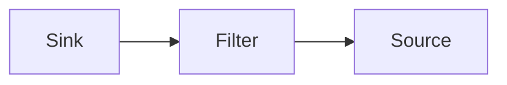
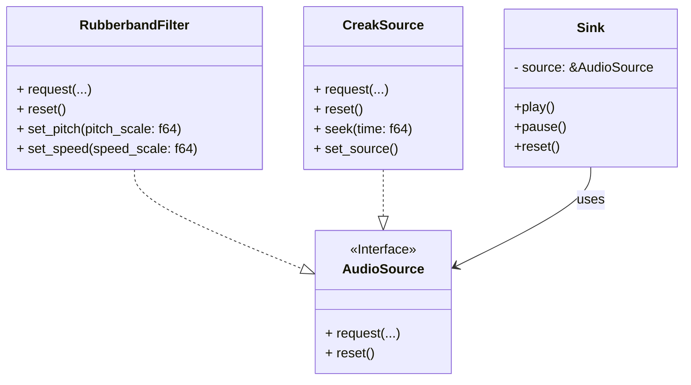

# Transcription Player

## Design

```mermaid
flowchart LR
    Sink --> Filter --> Source
```


```mermaid
classDiagram
    class Sink {
        - source: &AudioSource

        +play()
        +pause()
        +reset()
    }

    class AudioSource {
        <<Interface>>
        + request(...)
        + reset()
    }

    class RubberbandFilter {
        + request(...)
        + reset()
        + set_pitch(pitch_scale: f64)
        + set_speed(speed_scale: f64)
    }

    class CreakSource {
        + request(...)
        + reset()
        + seek(time: f64)
        + set_source()
    }

    RubberbandFilter ..|> AudioSource
    CreakSource ..|> AudioSource
    Sink --> AudioSource : uses
```


```mermaid
```